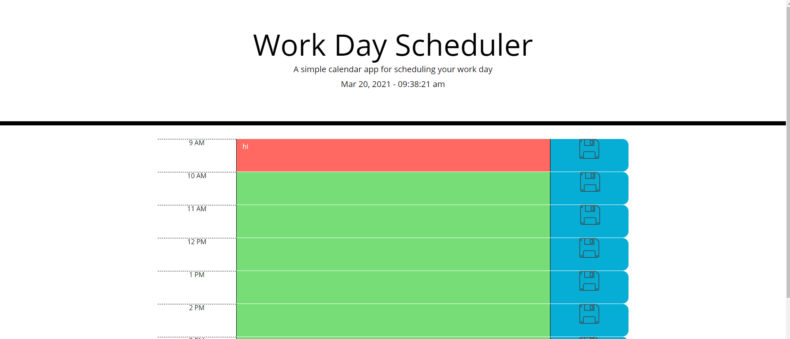

# Work Day Scheduler Starter Code

## Purpose
A work day scheduler where a user can write down daily tasks. The background color of the task will change depending on time of the day. Tasks can be saved, and the data will persist past closing down the browser. 

## Built With
* HTML
* CSS/ Bootstrap
* Javascript/ jQuery
* Moment.js

## Website
https://rkurian97.github.io/workday-scheduler/

##

## Contribution
Made by Rohith Kurian. 